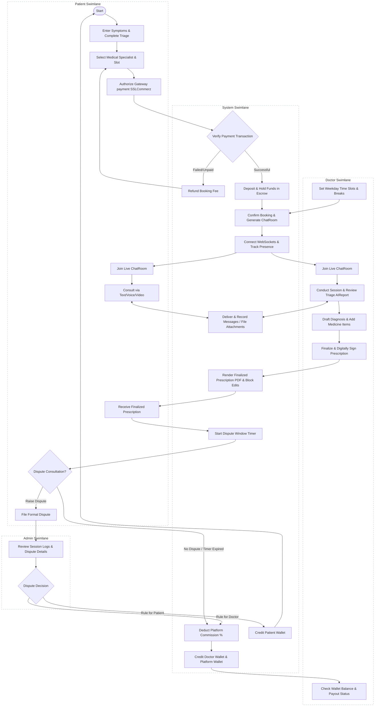

# Amar Doctor - Operational Activity Diagram

This document contains a UML Swimlane Activity Diagram showing the flow of actions across the four primary system actors: **Patient**, **Doctor**, **System (Backend / AI)**, and **Admin**.

---

## Swimlane Activity Diagram (Mermaid)

