# Amar Doctor - Database ERD & Data Dictionary

This document details the database schema, entity relationships, and column details for the **Amar Doctor** platform backend (Django REST Framework).

---

## 1. Entity Relationship Diagram (Mermaid)

Below is the complete entity relationship diagram representing all core apps (`accounts`, `appointments`, `triage`, `prescriptions`, `chat`, `payments`, `wallets`, `notifications`, `audit_logs`).

```mermaid
erDiagram
    User {
        int id PK
        string email UK
        string full_name
        string role "patient | doctor | admin"
        boolean is_verified
        boolean is_active
        boolean is_staff
        boolean is_suspended
        text suspension_reason
        datetime suspended_at
        int suspended_by_id FK
        datetime created_at
        datetime updated_at
    }

    DoctorProfile {
        int id PK
        int user_id FK, UK
        string specialization
        string bmdc_number
        string documents
        decimal consultation_fee
        string verification_status "pending | approved | rejected | suspended"
        text verification_notes
        int verified_by_id FK
        datetime verified_at
        boolean is_available
    }

    AdminProfile {
        int id PK
        int user_id FK, UK
        string admin_role "super_admin | operations_admin | finance_admin | support_admin | doctor_verification_admin"
        int created_by_id FK
        datetime created_at
        datetime updated_at
    }

    DoctorAvailability {
        int id PK
        int doctor_id FK
        int weekday "0-6 (Mon-Sun)"
        time start_time
        time end_time
        int slot_duration_minutes
        time break_start_time
        time break_end_time
        int max_appointments_per_slot
        string timezone
        boolean is_active
        datetime created_at
        datetime updated_at
    }

    DoctorBlockedSlot {
        int id PK
        int doctor_id FK
        datetime start_datetime
        datetime end_datetime
        text reason
        datetime created_at
    }

    Appointment {
        int id PK
        string booking_reference UK
        int patient_id FK
        int doctor_id FK
        int ai_report_id FK, UK
        string consultation_type "text | video | voice"
        datetime scheduled_start
        datetime scheduled_end
        string timezone
        string status "pending | doctor_approved | confirmed | in_progress | completed | cancelled | rejected | missed"
        string payment_status "unpaid | paid_held | released | refunded | disputed"
        decimal consultation_fee
        text cancellation_reason
        int cancelled_by_id FK
        text notes
        boolean no_prescription_required
        datetime created_at
        datetime updated_at
    }

    AppointmentStatusLog {
        int id PK
        int appointment_id FK
        string previous_status
        string new_status
        int changed_by_id FK
        text reason
        json metadata
        datetime created_at
    }

    ConsultationDispute {
        int id PK
        int appointment_id FK
        int opened_by_id FK
        text reason
        string status "open | investigating | resolved | rejected"
        text resolution_notes
        int resolved_by_id FK
        datetime resolved_at
        datetime created_at
        datetime updated_at
    }

    AITriageSession {
        int id PK
        int patient_id FK
        string status "active | ai_processing | waiting_for_patient | completed | cancelled"
        string language
        int current_step
        string risk_level "low | medium | high | emergency"
        boolean emergency_detected
        string ai_provider
        datetime started_at
        datetime completed_at
        datetime updated_at
    }

    AITriageMessage {
        int id PK
        int session_id FK
        string sender_type "patient | ai | system"
        string message_type "symptom | follow_up_question | answer | warning | summary | status_update"
        text content
        json metadata
        datetime created_at
    }

    AIReport {
        int id PK
        int session_id FK, UK
        int patient_id FK
        json extracted_symptoms
        string symptom_duration
        string severity_level
        json follow_up_answers
        json emergency_flags
        text ai_summary
        string risk_category
        string recommended_specialization
        float triage_score
        float ai_confidence_score
        datetime generated_at
    }

    Prescription {
        int id PK
        int appointment_id FK, UK
        int patient_id FK
        int doctor_id FK
        text diagnosis_notes
        text advice_notes
        text follow_up_instructions
        string status "draft | finalized | cancelled"
        datetime issued_at
        datetime finalized_at
        datetime created_at
        datetime updated_at
    }

    PrescriptionItem {
        int id PK
        int prescription_id FK
        string medicine_name
        string generic_name
        string dosage
        string frequency
        string duration
        string instruction
        int quantity
        datetime created_at
    }

    PrescriptionAttachment {
        int id PK
        int prescription_id FK
        string file
        string attachment_type
        datetime created_at
    }

    ChatRoom {
        int id PK
        int appointment_id FK, UK
        int patient_id FK
        int doctor_id FK
        string consultation_type "text | video | voice"
        string status "waiting | active | ended | cancelled"
        datetime started_at
        datetime ended_at
        datetime created_at
        datetime updated_at
    }

    ChatParticipantState {
        int id PK
        int room_id FK
        int user_id FK
        boolean is_online
        datetime last_seen_at
        boolean typing_status
        datetime updated_at
    }

    ChatMessage {
        int id PK
        int room_id FK
        int sender_id FK
        string message_type "text | system | prescription | consultation_event | image | file"
        text content
        json metadata
        boolean is_read
        datetime read_at
        datetime created_at
        datetime updated_at
    }

    Notification {
        int id PK
        int recipient_id FK
        string notification_type "appointment | consultation | payment | prescription | system"
        string title
        text message
        json payload
        boolean is_read
        datetime read_at
        datetime created_at
    }

    NotificationPreference {
        int id PK
        int user_id FK, UK
        boolean email_enabled
        boolean websocket_enabled
        boolean push_enabled
        boolean appointment_notifications
        boolean consultation_notifications
        boolean payment_notifications
        boolean prescription_notifications
        datetime updated_at
    }

    PlatformSettings {
        int id PK
        decimal consultation_commission_percentage
        datetime updated_at
    }

    PaymentTransaction {
        int id PK
        int user_id FK
        int appointment_id FK
        decimal amount
        string status "initiated | paid_held | released | refunded | failed | disputed"
        string gateway_provider
        string transaction_id
        string val_id
        json metadata
        datetime held_at
        datetime released_at
        datetime refunded_at
        datetime created_at
        datetime updated_at
    }

    PatientWallet {
        int id PK
        int patient_id FK, UK
        decimal available_balance
        decimal pending_balance
        decimal lifetime_spent
        datetime created_at
        datetime updated_at
    }

    DoctorWallet {
        int id PK
        int doctor_id FK, UK
        decimal available_balance
        decimal pending_balance
        decimal lifetime_earnings
        decimal total_platform_fees_paid
        datetime created_at
        datetime updated_at
    }

    PlatformWallet {
        int id PK
        decimal available_balance
        decimal lifetime_revenue
        datetime updated_at
    }

    WalletTransaction {
        int id PK
        string wallet_type "patient | doctor | platform"
        int patient_wallet_id FK
        int doctor_wallet_id FK
        int platform_wallet_id FK
        int appointment_id FK
        string transaction_type "consultation_payment_hold | consultation_release | consultation_refund | platform_commission | withdrawal | deposit | adjustment"
        string direction "credit | debit"
        decimal amount
        decimal previous_balance
        decimal new_balance
        json metadata
        string reference UK
        string status "pending | completed | failed | reversed"
        datetime created_at
    }

    AuditLog {
        int id PK
        int actor_id FK
        string action_type "create | update | delete | approve | reject | refund | payout | suspension | unsuspension | login | export | flag | deactivation"
        string target_model
        bigint target_id
        json previous_data
        json new_data
        string ip_address
        text user_agent
        json metadata
        datetime created_at
    }

    %% Relationships
    User ||--o{ User : "suspended_by"
    User ||--o| DoctorProfile : "has profile"
    User ||--o| AdminProfile : "has profile"
    User ||--o{ DoctorProfile : "verifies doctor"
    User ||--o{ AdminProfile : "creates admin"
    User ||--o{ DoctorAvailability : "has schedule"
    User ||--o{ DoctorBlockedSlot : "blocks schedule"
    
    User ||--o{ Appointment : "books as patient"
    User ||--o{ Appointment : "consults as doctor"
    User ||--o{ Appointment : "cancels appointment"
    
    Appointment ||--o{ AppointmentStatusLog : "logs status transitions"
    User ||--o{ AppointmentStatusLog : "changes status"
    
    Appointment ||--o{ ConsultationDispute : "has disputes"
    User ||--o{ ConsultationDispute : "opens dispute"
    User ||--o{ ConsultationDispute : "resolves dispute"
    
    User ||--o{ AITriageSession : "initiates session"
    AITriageSession ||--o{ AITriageMessage : "contains messages"
    AITriageSession ||--|| AIReport : "generates report"
    User ||--o{ AIReport : "owns report"
    Appointment ||--o| AIReport : "references triage report"
    
    Appointment ||--o| Prescription : "creates prescription"
    User ||--o{ Prescription : "receives prescription"
    User ||--o{ Prescription : "issues prescription"
    Prescription ||--o{ PrescriptionItem : "contains items"
    Prescription ||--o{ PrescriptionAttachment : "attaches files"
    
    Appointment ||--o| ChatRoom : "initiates room"
    User ||--o{ ChatRoom : "participates as patient"
    User ||--o{ ChatRoom : "participates as doctor"
    ChatRoom ||--o{ ChatParticipantState : "tracks connection state"
    User ||--o{ ChatParticipantState : "has presence"
    ChatRoom ||--o{ ChatMessage : "contains messages"
    User ||--o{ ChatMessage : "sends messages"
    
    User ||--o{ Notification : "receives notification"
    User ||--|| NotificationPreference : "configures preferences"
    
    User ||--o{ PaymentTransaction : "pays"
    Appointment ||--o{ PaymentTransaction : "facilitates payment for"
    
    User ||--o| PatientWallet : "has wallet"
    User ||--o| DoctorWallet : "has wallet"
    
    PatientWallet ||--o{ WalletTransaction : "performs transactions"
    DoctorWallet ||--o{ WalletTransaction : "performs transactions"
    PlatformWallet ||--o{ WalletTransaction : "performs transactions"
    Appointment ||--o{ WalletTransaction : "records transaction for"
    
    User ||--o{ AuditLog : "acts on"
```

---

## 2. Component/App Breakdown

The platform consists of several module areas:

### Accounts (`accounts`)
*   **[User](file:///e:/personal-projects/amardoctor/core/accounts/models.py#L32)**: The core user identity. Differentiates roles (`patient`, `doctor`, `admin`). Supports account suspension.
*   **[DoctorProfile](file:///e:/personal-projects/amardoctor/core/accounts/models.py#L79)**: Additional profile details for verified doctors, tracking specialization, BMDC numbers, verification files, status, and fee settings.
*   **[AdminProfile](file:///e:/personal-projects/amardoctor/core/accounts/models.py#L131)**: Granular roles for platform administrator accounts.

### Appointments & Scheduling (`appointments`)
*   **[DoctorAvailability](file:///e:/personal-projects/amardoctor/core/appointments/models/availability.py#L6)**: Standard weekday availability parameters and session length config for doctors.
*   **[DoctorBlockedSlot](file:///e:/personal-projects/amardoctor/core/appointments/models/availability.py#L57)**: Ad-hoc blockout periods (vacations, emergencies, etc.) where appointments cannot be scheduled.
*   **[Appointment](file:///e:/personal-projects/amardoctor/core/appointments/models/appointment.py#L6)**: Booked consultations between patients and doctors, representing the lifecycle of scheduling, payment status, and consultation statuses.
*   **[AppointmentStatusLog](file:///e:/personal-projects/amardoctor/core/appointments/models/logs.py#L5)**: Logs all status transitions to track workflow history.

### AI Triage (`triage`)
*   **[AITriageSession](file:///e:/personal-projects/amardoctor/core/triage/models.py#L4)**: The interactive chat session with Gemini/AI to diagnose symptom risk severity.
*   **[AITriageMessage](file:///e:/personal-projects/amardoctor/core/triage/models.py#L34)**: Message history of triage chat (questions, symptom details, etc.).
*   **[AIReport](file:///e:/personal-projects/amardoctor/core/triage/models.py#L63)**: Extracted summary reports with a confidence score, triage level, and recommended specialty, linked to an appointment once booked.

### Chat System (`chat`)
*   **[ChatRoom](file:///e:/personal-projects/amardoctor/core/chat/models/room.py#L5)**: Live consultation room linked to an appointment.
*   **[ChatParticipantState](file:///e:/personal-projects/amardoctor/core/chat/models/participant.py#L5)**: Real-time user online/presence check and typing status indicators.
*   **[ChatMessage](file:///e:/personal-projects/amardoctor/core/chat/models/message.py#L5)**: Individual text, image, system, or prescription shared messages.

### Prescriptions (`prescriptions`)
*   **[Prescription](file:///e:/personal-projects/amardoctor/core/prescriptions/models.py#L5)**: Official digital prescription linked to a consultation.
*   **[PrescriptionItem](file:///e:/personal-projects/amardoctor/core/prescriptions/models.py#L38)**: Particular medicines, generic name, dosage, frequency, and instructions.
*   **[PrescriptionAttachment](file:///e:/personal-projects/amardoctor/core/prescriptions/models.py#L56)**: Attached diagnostics, laboratory reports, or images.

### Payments & Wallets (`payments`, `wallets`)
*   **[PlatformSettings](file:///e:/personal-projects/amardoctor/core/payments/models.py#L6)**: Global system settings, such as platform commission rates.
*   **[PaymentTransaction](file:///e:/personal-projects/amardoctor/core/payments/models.py#L23)**: Ledger records for external payments via payment gateways (e.g. SSLCommerz).
*   **[PatientWallet](file:///e:/personal-projects/amardoctor/core/wallets/models.py#L6)** / **[DoctorWallet](file:///e:/personal-projects/amardoctor/core/wallets/models.py#L17)** / **[PlatformWallet](file:///e:/personal-projects/amardoctor/core/wallets/models.py#L29)**: Double-entry-adjacent account balances to hold funds in escrow and handle commission fee payouts.
*   **[WalletTransaction](file:///e:/personal-projects/amardoctor/core/wallets/models.py#L43)**: Ledgers for specific balances, tracking credits/debits, references, and balance changes.

### Notifications & Auditing (`notifications`, `audit_logs`)
*   **[Notification](file:///e:/personal-projects/amardoctor/core/notifications/models.py#L4)**: Platform notifications for appointments, payments, and system notices.
*   **[NotificationPreference](file:///e:/personal-projects/amardoctor/core/notifications/models.py#L40)**: Settings for email, WebSocket, and push notices.
*   **[AuditLog](file:///e:/personal-projects/amardoctor/core/audit_logs/models/audit_log.py#L5)**: Read-only, append-only security logs tracking actions on any critical entity model.
