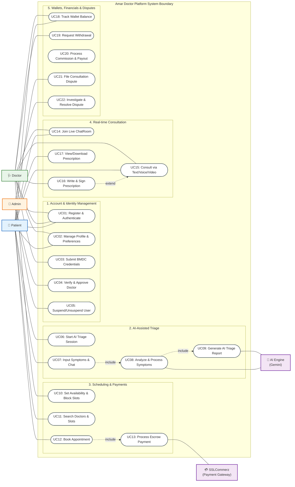

# Amar Doctor - UML Use Case Diagram

This document provides a comprehensive UML Use Case Diagram and detailed specifications representing the interactions between the actors and the **Amar Doctor** platform.

---

## 1. Actors Description

| Icon | Actor | Type | Description |
|---|---|---|---|
| 👤 | **Patient** | Primary (Initiator) | The client seeking medical consultation. Can register, run AI triage, book appointments, make payments, participate in consultations, view prescriptions, manage their wallet, and file disputes. |
| 🩺 | **Doctor** | Primary (Practitioner) | The medical professional providing services. Can register, submit BMDC verification documents, configure scheduling availability, consult with patients, draft and digitally sign prescriptions, and withdraw earnings. |
| 🔑 | **Admin** | Primary (Operations) | Platform administrator who manages doctor verification, user suspensions, dispute investigations, global configurations, and tracks financial health. |
| 🤖 | **AI Engine (Gemini)** | Supporting (System) | The AI subsystem that parses patient symptoms, leads the diagnostic triage question loop, and generates the structured triage report. |
| 💳 | **SSLCommerz Gateway** | Supporting (External) | The external payment processor responsible for capturing fees, holding funds in escrow, and handling refunds. |

---

## 2. Use Case Diagram (Mermaid)

Below is the complete Use Case Diagram showing the system boundary, categorized modules, and relationships:

---

## 3. Detailed Use Case Specifications

### Module 1: Account & Identity Management
*   **UC01: Register & Authenticate**
    *   *Actors:* Patient, Doctor, Admin
    *   *Description:* Allows users to sign up and establish credentials. Role-based routing assigns patients to the main flow and doctors to the credential onboarding flow.
*   **UC02: Manage Profile & Preferences**
    *   *Actors:* Patient, Doctor
    *   *Description:* Allows updating bio, timezone, profile image, and notifications configurations (WebSockets, push, and email).
*   **UC03: Submit BMDC Credentials**
    *   *Actors:* Doctor
    *   *Description:* Doctors upload their Bangladesh Medical & Dental Council (BMDC) credentials, certificates, and professional history for manual audit.
*   **UC04: Verify & Approve Doctor**
    *   *Actors:* Admin
    *   *Description:* Operation administrators review the submitted BMDC documents, approve/reject registration, or suspend existing doctor accounts.
*   **UC05: Suspend/Unsuspend User**
    *   *Actors:* Admin
    *   *Description:* Allows admins to suspend/unsuspend patient or doctor accounts for policy violations, with required audit logging of reasons.

### Module 2: AI-Assisted Triage
*   **UC06: Start AI Triage Session**
    *   *Actors:* Patient
    *   *Description:* Starts a structured session where the patient interacts with the system to identify symptom severity.
*   **UC07: Input Symptoms & Chat**
    *   *Actors:* Patient
    *   *Description:* Patient types out symptoms in natural language (English/Bengali) and answers interactive diagnostic prompts.
*   **UC08: Analyze & Process Symptoms**
    *   *Actors:* AI Engine
    *   *Description:* The AI Engine parses responses, detects emergency red flags, and evaluates severity levels.
*   **UC09: Generate AI Triage Report**
    *   *Actors:* AI Engine
    *   *Description:* Completes the session by creating a permanent structured report outlining symptoms, risk level (Low to Emergency), and recommended medical specialties.

### Module 3: Scheduling & Payments
*   **UC10: Set Availability & Block Slots**
    *   *Actors:* Doctor
    *   *Description:* Doctors set standard weekly shifts, slot durations, and break times, or temporarily block calendar days for holidays/leaves.
*   **UC11: Search Doctors & Slots**
    *   *Actors:* Patient
    *   *Description:* Allows patients to filter doctors based on specialization (optionally recommended by AI Triage), fees, ratings, and active availability slots.
*   **UC12: Book Appointment**
    *   *Actors:* Patient
    *   *Description:* Books a consultation slot. *Includes* processing payment escrow.
*   **UC13: Process Escrow Payment**
    *   *Actors:* SSLCommerz Gateway
    *   *Description:* Processes credit card, mobile banking, or wallet transactions. Upon success, holds the fee in the system's pending escrow balance.

### Module 4: Real-time Consultation
*   **UC14: Join Live ChatRoom**
    *   *Actors:* Patient, Doctor
    *   *Description:* Activates when the scheduled time slot arrives, establishing WebSocket presence for real-time online/typing states.
*   **UC15: Consult via Text/Voice/Video**
    *   *Actors:* Patient, Doctor
    *   *Description:* Conducts the session. Messaging options support sharing symptom details, files, and rich media.
*   **UC16: Write & Sign Prescription**
    *   *Actors:* Doctor
    *   *Description:* Allows the doctor to draft diagnostics, advice, generic drug entries, dosages, and apply their digital signature. This *extends* the consultation session.
*   **UC17: View/Download Prescription**
    *   *Actors:* Patient
    *   *Description:* Displays the locked, read-only PDF prescription generated by the backend once finalized.

### Module 5: Wallets, Financials & Disputes
*   **UC18: Track Wallet Balance**
    *   *Actors:* Patient, Doctor
    *   *Description:* Displays available balance, pending escrow balance, and lifetime transaction histories.
*   **UC19: Request Withdrawal**
    *   *Actors:* Doctor
    *   *Description:* Allows doctors to request payouts of their settled available wallet balances.
*   **UC20: Process Commission & Payout**
    *   *Actors:* System Backend
    *   *Description:* Calculates platform commission percentage, deposits the platform portion, and transfers the remaining fee to the doctor's available wallet balance.
*   **UC21: File Consultation Dispute**
    *   *Actors:* Patient
    *   *Description:* Allows patients to dispute the consultation outcome within the system's set time window, halting automatic escrow release.
*   **UC22: Investigate & Resolve Dispute**
    *   *Actors:* Admin
    *   *Description:* Admins audit session message logs and triage data to rule in favor of the patient (refunding the escrow fee) or the doctor (releasing the payout).
